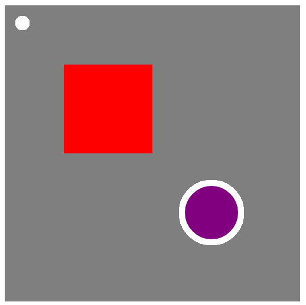
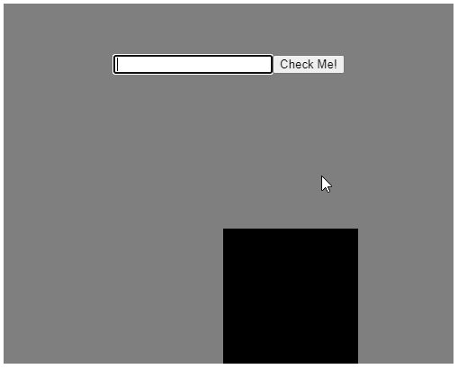
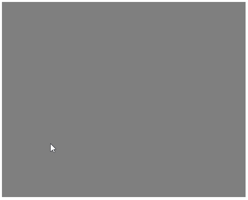

# P5.js przykłady i ćwiczenia
W repozytorium znajdziemy przykłady wykorzystania biblioteki p5, foldery te rozpoczynają się od przedrostka `example-`.

Poniżej znajduje się lista ćwiczeń, które kursant powinien wykonać w celu zaliczenia labolatorium. Pod każdym ćwiczeniem dołączona jest grafika poglądowa z efektem ćwiczenia do wykonania. Rozwiązania znajdują się w folderach z przedrostkiem `solution-`.

# Ćwiczenia
### 1. Rysowanie figur.
Narysuj figury jak na rysunku:

### 2. Animowany kolor figury
Stwórz kwadrat, który będzie przenikał pomiędzy kolorem o wartoci od: 0 do 255 i od 255 do 0.

### 3. Obsługa pól tekstowych. 
Utwórz pole tekstowe i przycisk _(za pomocą biblioteki p5.js)_. Na dole ekranu powinien poruszać się kwadrat w kolorze czarnym. Po wpisaniu słowa "placek", kwadrat zmienia kolor na zielony, w przeciwnym wypadku, kolor jest zmieniany na czerwony.

### 4. Połącz kropki.
Swtórz prosty program, który będzie łączył kolejne punkty przyciśnięcia myszy linią. W miejscu wystąpienia przyciśnięcia, powinna pojawić się również czerwona kropka.

# Używaj referencji
W poniższym linku znajdziesz opis działania najpopularniejszych funkcji biblioteki -
[Opis funkcji](https://p5js.org/reference)

# Większy przykład
Szerszy przykłąd dostępny w repozytorium:
[Feed the birds](https://github.com/MateuszMyalski/feed-the-birds)
wraz z [opisem](https://mateuszmyalski.github.io/2018/05/20/symulator-karmienia-ptak%C3%B3w-biblioteka-p5).
